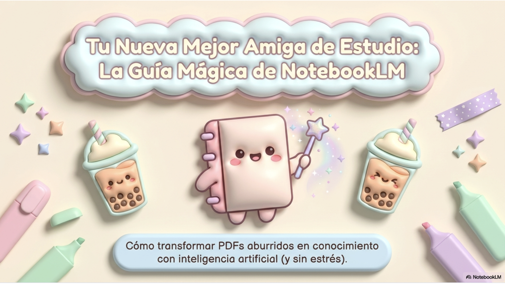

# NotebookLM desde cero 🌷

Repositorio educativo en español para aprender a usar NotebookLM desde cero, con prompts, guías y materiales pensados para clases y estudio.

## ✨ ¿Qué encontrarás aquí?

- Prompts en español para distintos objetivos de aprendizaje.
- Guías para estudiar de forma más clara y ordenada.
- Enfoques de reforzamiento positivo para acompañar procesos.
- Ideas para creación de materiales educativos.
- Recursos de psicología del color aplicados a contenidos.
- Recursos descargables en PDF con vista previa visual.

## 🚀 Empieza por aquí

1. Crea un notebook.
2. Sube una fuente.
3. Elige un prompt.
4. Revisa las citas.
5. Ajusta la respuesta según tu objetivo.

## 📚 Material descargable

Haz clic en la imagen para abrir el PDF.

Haz clic en la imagen para abrir el PDF.

Placeholder pendiente (aún no disponible en el repositorio):

Haz clic en la imagen para abrir el PDF.

## 🧠 Prompts destacados

| Categoría | Para qué sirve | Archivo |
| --- | --- | --- |
| Aprender desde cero | Explicar conceptos paso a paso con lenguaje claro. | `notebooklm-paso-a-pasito/prompts/01-aprender-desde-cero.md` |
| Guía de aprendizaje | Convertir fuentes en rutas de estudio accionables. | `notebooklm-paso-a-pasito/prompts/02-guia-de-aprendizaje.md` |
| Reforzamiento positivo | Entregar feedback amable y motivador. | `notebooklm-paso-a-pasito/prompts/03-reforzamiento-positivo.md` |
| Materiales educativos | Diseñar recursos para clases y actividades. | `notebooklm-paso-a-pasito/prompts/04-crear-materiales-educativos.md` |
| Psicología del color | Mejorar legibilidad y experiencia visual. | `notebooklm-paso-a-pasito/prompts/05-psicologia-del-color.md` |
| Preparar clases | Organizar sesiones con objetivos claros. | `notebooklm-paso-a-pasito/prompts/06-preparar-clases.md` |
| Prompts rápidos | Resolver tareas frecuentes con velocidad. | `notebooklm-paso-a-pasito/prompts/07-prompts-rapidos.md` |

## 📁 Estructura del repositorio

- `notebooklm-paso-a-pasito/`: contenido base del proyecto (prompts, ejemplos y documentación).
- `notebooklm-paso-a-pasito/prompts/`: biblioteca de prompts en español.
- `notebooklm-paso-a-pasito/ejemplos/`: ejemplos de aplicación en contexto educativo.
- `pdfs/`: materiales descargables principales para compartir en clase.
- `assets/previews/`: imágenes PNG de vista previa para cada PDF.

## ⚠️ Importante

NotebookLM ayuda a trabajar con tus fuentes, pero siempre conviene revisar las citas, verificar información importante y usar criterio propio.

## 💜 Créditos

Creado por Alexandra Cifuentes como recurso educativo para aprender a usar NotebookLM con más claridad, intención pedagógica y cariño.
