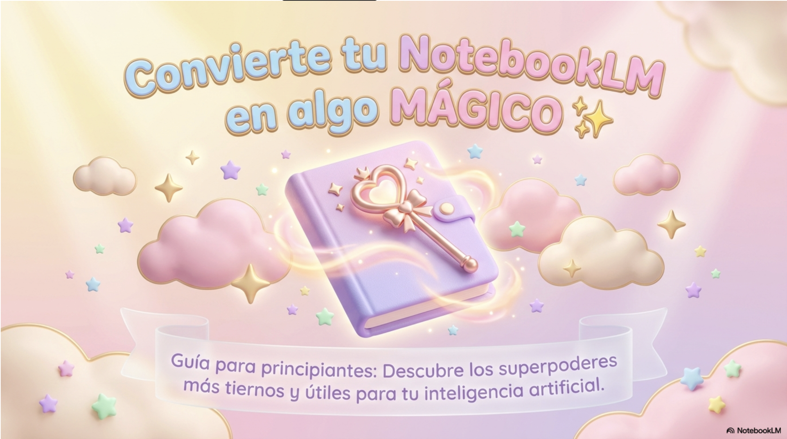

# NotebookLM desde cero

Repositorio con recursos en español para aprender y aplicar NotebookLM en estudio, docencia y creación de materiales educativos.

El contenido principal está en la carpeta:
- `notebooklm-paso-a-pasito/`

## Qué encontrarás

- Prompts listos para adaptar a distintos contextos.
- Ejemplos prácticos de uso.
- Materiales descargables en PDF.
- Portadas visuales para navegar mejor los recursos.

## Materiales destacados

Haz clic en cada portada para abrir su PDF:

## Estructura rápida

- `notebooklm-paso-a-pasito/prompts/`: prompts temáticos.
- `notebooklm-paso-a-pasito/ejemplos/`: casos de uso.
- `notebooklm-paso-a-pasito/pdfs/`: materiales en PDF.
- `notebooklm-paso-a-pasito/assets/previews/`: imágenes de portada.

## Nota

NotebookLM ayuda a trabajar con fuentes, pero siempre es recomendable revisar citas y verificar datos importantes antes de compartir o publicar material.
